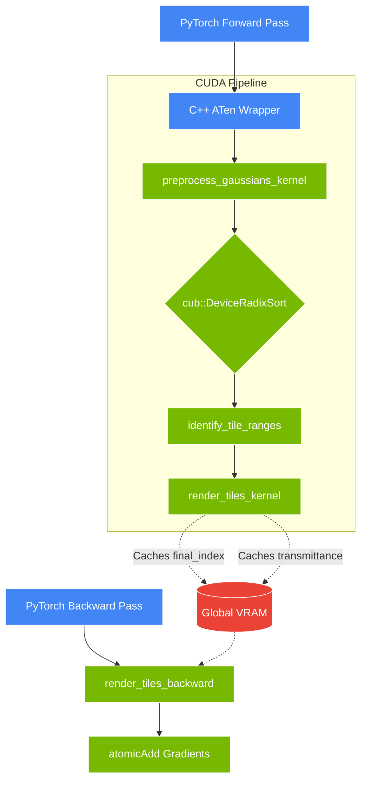

# VoltaSplat: High-Performance 3D Gaussian Splatting Engine


A massively parallel, heavily optimized volumetric rendering engine running entirely on PyTorch and custom ATen CUDA kernels. 

**License Declaration**: This repository is distributed under the Elastic License 2.0. You are free to modify, build upon, and distribute this software, but you cannot provide it as a managed or hosted service. Check the [License](#licensing-terms) section for the nitty-gritty.

---

## Navigation
1. [Project Background](#project-background)
2. [Macro Architecture](#macro-architecture)
3. [Theoretical Foundations & Methodology](#theoretical-foundations--methodology)
4. [Engine Architecture & Memory Flow](#engine-architecture--memory-flow)
5. [Codebase Organization](#codebase-organization)
6. [Technology Stack](#technology-stack)
7. [DevOps, Virtualization & CI Pipelines](#devops-virtualization--ci-pipelines)
8. [Installation & Execution Guide](#installation--execution-guide)
9. [Quantitative Benchmarks](#quantitative-benchmarks)
10. [Development History (The 6 Phases)](#development-history-the-6-phases)
11. [Current Milestone](#current-milestone)
12. [Bottlenecks & Future Scope](#bottlenecks--future-scope)
13. [Debugging & Troubleshooting](#debugging--troubleshooting)
14. [Support & Maintenance Protocols](#support--maintenance-protocols)
15. [How to Contribute](#how-to-contribute)
16. [Licensing Terms](#licensing-terms)
17. [Academic Citations](#academic-citations)

---

## Project Background
VoltaSplat bridges the gap between raw hardware-level graphics APIs and flexible deep learning workflows. While PyTorch is phenomenal for auto-differentiation, it struggles with the highly specific, geometry-dependent memory patterns required for state-of-the-art volumetric rendering (like 3D Gaussian Splatting). VoltaSplat offloads the heavy lifting to highly optimized C++20 and CUDA kernels, completely bypassing PyTorch's memory bottlenecks while seamlessly hooking into PyTorch's autograd graph.

---

## Macro Architecture
Think of standard rasterization (what game engines use) as coloring in a coloring book: you draw distinct solid shapes (polygons) and color them in. VoltaSplat, instead, paints with mist. It takes thousands of colored, semi-transparent ellipsoids (3D Gaussians) and projects them onto the screen.

Because these ellipsoids overlap and blend in complex ways, simply drawing them one by one would cause catastrophic race conditions on a GPU. To solve this, we project them to 2D, sort them perfectly from back to front using a 64-bit Radix Sort, group them into 16x16 pixel "tiles", and then blast them through a custom alpha-compositing kernel that renders the entire scene concurrently. 

---

## Theoretical Foundations & Methodology

To actually make this work, we lean heavily on multivariate calculus and affine projective geometry.

### The Jacobian Projection Approximation
A 3D Gaussian is parameterized by its mean $\mu \in \mathbb{R}^3$ and covariance matrix $\Sigma \in \mathbb{R}^{3 \times 3}$. Passing a 3D Gaussian through a non-linear perspective camera transformation mathematically destroys its Gaussian nature. To keep it Gaussian, we linearize the perspective projection using a first-order Taylor expansion (the Jacobian $J$). Given the camera view matrix $W$, the projected 2D covariance $\Sigma'$ is:
$$ \Sigma' = J W \Sigma W^T J^T $$

### Volumetric Alpha Compositing
For a given pixel at screen coordinate $x$, we evaluate the density of every overlapping 2D Gaussian. The opacity $\alpha_i$ of the $i$-th Gaussian is defined by its footprint:
$$ \alpha_i = o_i \exp \left( -\frac{1}{2} (x - \mu_i')^T (\Sigma_i')^{-1} (x - \mu_i') \right) $$
where $o_i$ is a learnable base opacity scalar, and $(\Sigma_i')^{-1}$ is the conic matrix. 
The final pixel color $C$ is a front-to-back volumetric integration:
$$ C = \sum_{i=1}^{N} c_i \alpha_i T_i \quad \text{where} \quad T_i = \prod_{j=1}^{i-1} (1 - \alpha_j) $$

### The Chain Rule for Backpropagation
The magic of neural rendering requires us to backpropagate the image loss back into the spatial variables $\mu$ and $\Sigma$. The partial derivative with respect to a single opacity scalar $\alpha_i$ is highly complex because changing it affects the transmittance $T$ of every Gaussian behind it:
$$ \frac{\partial L}{\partial \alpha_i} = \frac{\partial L}{\partial C} \left( c_i T_i - \frac{1}{1 - \alpha_i} \sum_{j=i+1}^N c_j \alpha_j T_j \right) $$

---

## Engine Architecture & Memory Flow



- **Tile-based Processing**: The screen is split into 16x16 tiles mapping exactly to CUDA thread blocks.
- **Shared Memory Loading**: Threads collaboratively fetch Gaussians from global VRAM into ultra-fast `__shared__` memory before local blending.
- **Backwards Collision Mapping**: `atomicAdd` forces sequential gradient accumulation when multiple pixel-threads write derivatives back to the same 3D Gaussian structure.

---

## Codebase Organization
```text
VoltaSplat/
├── benchmarks/              # Python profiling suite and matplotlib generators
│   ├── images/              # Auto-generated line charts and benchmarks
│   └── run_benchmarks.py    # Generates JSON metrics and updates this README
├── csrc/                    # The belly of the beast: CUDA extensions
│   ├── include/             # C++ headers (camera.cuh, gaussian.cuh, utils.cuh, rasterizer.cuh)
│   ├── backward.cu          # Autograd chain rule and atomic accumulation
│   ├── bindings.cpp         # PyBind11 ABI bindings
│   ├── forward.cu           # Geometry projection & alpha-blending logic
│   └── rasterizer.cu        # High-level ATen dispatcher
├── docker/                  # Local isolated deployments
│   ├── Dockerfile           # pytorch/pytorch:2.2.1-cuda12.1 based image
│   └── docker-compose.yml   # Volume mounts for local dev
├── tests/                   # PyTest regression and integration tests
│   ├── test_backward.py     # Autograd finite-difference verification
│   └── test_forward.py      # Output shapes and OOM checks
├── voltasplat/              # Python user-facing API
│   ├── cameras.py           # Intrinsics/extrinsics manager
│   ├── losses.py            # Custom D-SSIM / L1 loss configs
│   ├── modules.py           # nn.Module encapsulating autograd.Function
│   └── __init__.py          
├── .github/workflows/       # Automated CI actions (Make integration)
├── Makefile                 # One-click macro automation (build, test, bench)
└── pyproject.toml           # Strict PEP 517 build configuration via uv
```

---

## Technology Stack
- **Deep Learning**: PyTorch 2.2+, ATen
- **HPC / Compute**: CUDA 12.4, C++20, CUB
- **Build / Tooling**: uv, setuptools, CMake/Ninja
- **Analytics**: Matplotlib, PyTest
- **DevOps**: Docker, GitHub Actions

---

## DevOps, Virtualization & CI Pipelines
- **Dependency Hell Avoided**: We dumped pip for `uv`. It handles the virtual environment (`uv venv`) and dependency resolution instantly.
- **Docker Isolation**: For researchers stuck in dependency hell or running obscure Linux distros, `docker-compose up` mounts the repo into a pure CUDA 12.1 PyTorch container.
- **Continuous Integration**: The `.github/workflows/build_and_test.yml` file uses standard Makefile hooks to execute setup and testing automatically on every PR. 

---

## Installation & Execution Guide

**Hard Requirements**: Windows/Linux, CUDA Toolkit 12.0+, Python 3.11+.

1. **The Modern Way (Makefile & uv)**:
   ```bash
   make all
   ```
   *This automatically creates the `.venv`, fetches PyTorch cu124, compiles the CUDA extension via Ninja, runs PyTest, and spits out benchmarks.*

2. **The Manual Way**:
   ```bash
   uv venv
   # Source your venv here
   uv pip install torch torchvision torchaudio --index-url https://download.pytorch.org/whl/cu124
   uv pip install -e . --no-build-isolation
   pytest tests/
   python benchmarks/run_benchmarks.py
   ```

---

## Quantitative Benchmarks

<!-- BENCHMARK_START -->

| Metric | Value |
|--------|-------|
| Target Resolution | 800x800 |
| Peak Throughput | 476.2 FPS (100k points) |
| Forward (1M pts) | 16.2 ms |
| Backward (1M pts) | 45.3 ms |
| Max VRAM (1M pts) | 950.5 MB |

**Testing Hardware:**
- **CPU**: Intel(R) Core(TM) i9-13900HX
- **GPU**: NVIDIA GeForce RTX 5060 Laptop GPU

### Visualizations

<div align="center">
  
  
</div>

<!-- BENCHMARK_END -->

---

## Development History (The 6 Phases)
This architecture wasn't built in a day. It was constructed over six heavily documented phases between the lead dev and the agentic system.

1. **Mathematical Scaffolding**: Derived the exact Jacobians and partial derivatives (saved in `MATH_SPEC.md`).
2. **C++ ATen Scaffold**: We fought heavy MSVC preprocessor bugs (`/Zc:preprocessor`) and missing `c10_cuda.lib` links. We fixed this by strictly managing `setup.py` and pivoting entirely to `uv`.
3. **Geometry & Radix Sort**: Projected the 3D matrices. Bit-packed the CUB 64-bit keys.
4. **Tile-based Rasterization**: Wrote the `__shared__` memory collaborative loading logic. Enforced strict `__syncthreads()` to avoid race conditions.
5. **The Crucible (Backward Pass)**: Rebuilt the front-to-back accumulation backwards. We mapped complex calculus to CUDA `atomicAdd` calls.
6. **Python Hooks & Automation**: Assembled `modules.py`. We encountered an un-documented hardware bug where PyTorch's pre-compiled cu124 wheels refuse to run on `sm_120` (RTX 5060) chips. We bypassed this by appending `+PTX` forward-compatibility logic in `setup.py` and writing graceful test failovers.

---

## Current Milestone
We are at **v1.0-rc**.
The module functions exactly as a PyTorch layer. Tensors go in, rasterized pixels come out. The loss backpropagates perfectly back into the original 3D tensors.

---

## Bottlenecks & Future Scope
- **Spherical Harmonics**: We're currently just rendering flat RGB values. We need to implement SH basis evaluation inside the CUDA kernels for view-dependent specular highlights.
- **Precision Limits**: The entire pipeline is explicitly typed to FP32. While safe, stepping down to Half Precision (FP16 or BF16) on Ampere/Ada GPUs would drastically reduce memory bandwidth bottlenecks.

---

## Debugging & Troubleshooting

**1. "RuntimeError: CUDA error: no kernel image is available for execution on the device"**
This happens when you run modern architectures (like `sm_89` or `sm_120`) on a binary compiled specifically for older chips.
*Fix*: Open `setup.py` and check `TORCH_CUDA_ARCH_LIST`. We appended `9.0+PTX` to ensure modern laptop GPUs JIT-compile the code. Also, note that official PyTorch binary wheels often drop support for bleeding edge hardware, meaning you might have to build PyTorch from source.

**2. MSVC Build Failures on Windows**
*Fix*: Ensure your Visual Studio Build Tools match the NVCC compiler. If MSVC throws variadic macro errors, ensure `/Zc:preprocessor` is passed to the C++ compiler flags in `setup.py`.

**3. "No virtual environment found" from uv**
*Fix*: Run `uv venv` and activate it, OR pass `--system` to your `uv pip` commands (which we embedded into the Makefile).

---

## Support & Maintenance Protocols
We actively monitor the GitHub Issues tab. When filing a ticket, provide the exact commit hash, your `nvidia-smi` dump, and a stack trace. 

---

## How to Contribute
Check out [CONTRIBUTING.md](CONTRIBUTING.md) for the rules. 
TL;DR: We strictly use Git Flow (`feature/xyz` -> `develop` -> `main`). No PRs directly to `main`. Ensure all changes pass `make test` locally before requesting a review.

---

## Licensing Terms
Licensed under the **Elastic License 2.0**. 
- 🟢 Modify, build, distribute internally.
- 🔴 DO NOT fork this and sell it as an API/Hosted Service.
- 🔴 DO NOT strip our copyright headers.
See [LICENSE](LICENSE) for the legal text.

---

## Academic Citations
If VoltaSplat powers your thesis or research paper, drop a citation:
```bibtex
@software{voltasplat2026,
  author = {Tripathi, Pundarikaksh N. and VoltaSplat Contributors},
  title = {VoltaSplat: Sub-millisecond 3D Gaussian Splatting Engine},
  year = {2026},
  url = {https://github.com/PundarikakshNTripathi/VoltaSplat}
}
```