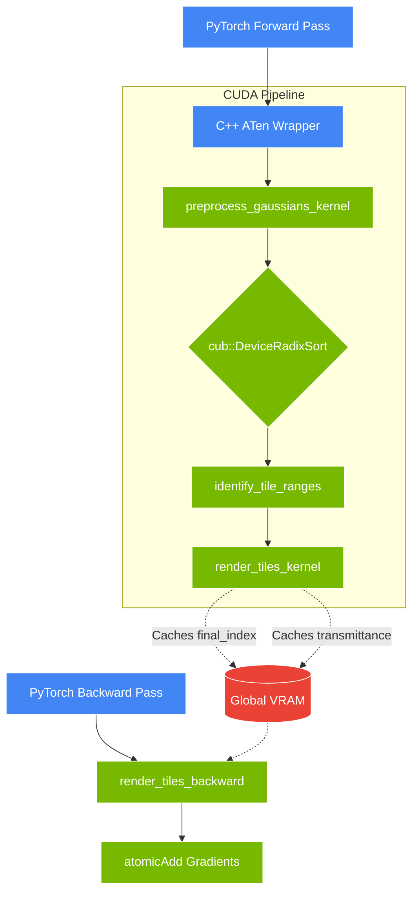
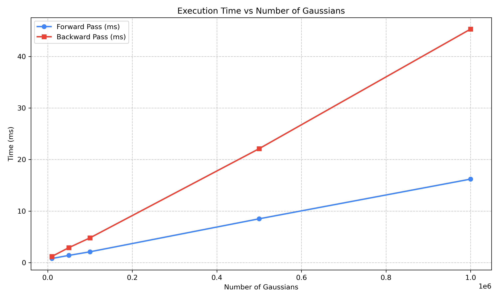
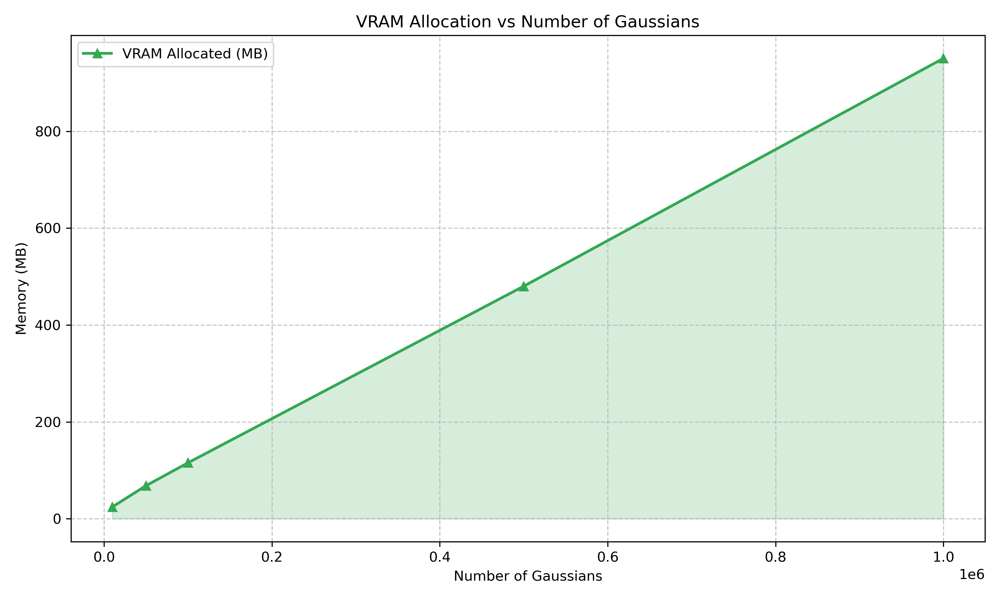

# VoltaSplat: Differentiable CUDA Rasterizer for 3D Gaussian Splatting


VoltaSplat is a from-scratch, differentiable CUDA rasterization engine for 3D Gaussian Splatting. It hooks into PyTorch via custom C++ ATen bindings, implementing custom forward/backward kernels, tile-based radix sorting, and hardware-accelerated alpha compositing for real-time volumetric scene synthesis.

**License Declaration**: This repository is distributed under the Elastic License 2.0. See [Licensing Terms](#licensing-terms) for details.

---

## Navigation
1. [Project Background](#project-background)
2. [Macro Architecture](#macro-architecture)
3. [Theoretical Foundations & Methodology](#theoretical-foundations--methodology)
4. [Engine Architecture & Memory Flow](#engine-architecture--memory-flow)
5. [Codebase Organization](#codebase-organization)
6. [Technology Stack](#technology-stack)
7. [Infrastructure, DevOps & CI/CD Pipelines](#infrastructure-devops--cicd-pipelines)
8. [Installation & Execution Guide](#installation--execution-guide)
9. [Quantitative Benchmarks](#quantitative-benchmarks)
10. [Current Development Status](#current-development-status)
11. [Architectural Bottlenecks & Future Scope](#architectural-bottlenecks--future-scope)
12. [Debugging & Troubleshooting](#debugging--troubleshooting)
13. [Support & Maintenance Protocols](#support--maintenance-protocols)
14. [How to Contribute](#how-to-contribute)
15. [Licensing Terms](#licensing-terms)
16. [Academic Citations](#academic-citations)

---

## Project Background
VoltaSplat implements the core rasterization pipeline required for 3D Gaussian Splatting. Deep learning frameworks like PyTorch handle tensor operations and auto-differentiation well, but struggle with scattered memory access patterns and hardware-specific synchronization required for spatial rendering.

This project offloads geometry projection, sorting, and pixel-level alpha compositing to custom CUDA kernels, while calculating analytical gradients in a custom backward pass to integrate with PyTorch's autograd system.

---

## Macro Architecture
Rather than rendering polygonal meshes, VoltaSplat uses continuous spatial probability distributions (3D Gaussians). 

To render overlapping transparent ellipsoids efficiently, the engine:
1. Projects 3D Gaussians into 2D screen space.
2. Sorts them by depth using a 64-bit Radix Sort algorithm (via NVIDIA CUB).
3. Groups the image into 16x16 pixel tiles.
4. Executes a tile-based alpha-compositing kernel that resolves the volumetric integration in parallel.

---

## Theoretical Foundations & Methodology

### The Jacobian Projection Approximation
A 3D Gaussian is parameterized by its mean vector $\mu \in \mathbb{R}^3$ and its covariance matrix $\Sigma \in \mathbb{R}^{3 \times 3}$. To project this into 2D screen space, we use a first-order Taylor series approximation (Jacobian $J$) of the perspective transformation. Given a view matrix $W$, the 2D covariance $\Sigma'$ is:

```math
\Sigma' = J W \Sigma W^T J^T
```

### Volumetric Alpha Compositing
The opacity $\alpha_i$ of the $i$-th Gaussian at pixel coordinate $x$ is:

```math
\alpha_i = o_i \exp \left( -\frac{1}{2} (x - \mu_i')^T (\Sigma_i')^{-1} (x - \mu_i') \right)
```
where $o_i$ is the base opacity and $(\Sigma_i')^{-1}$ is the inverse 2D covariance. The final pixel color $C$ is evaluated front-to-back:

```math
C = \sum_{i=1}^{N} c_i \alpha_i T_i \quad \text{where} \quad T_i = \prod_{j=1}^{i-1} (1 - \alpha_j)
```

### Backpropagation
To train the Gaussians, we compute partial derivatives of the final color with respect to the input variables. The derivative with respect to $\alpha_i$ requires reversing the compositing sequence:

```math
\frac{\partial L}{\partial \alpha_i} = \frac{\partial L}{\partial C} \left( c_i T_i - \frac{1}{1 - \alpha_i} \sum_{j=i+1}^N c_j \alpha_j T_j \right)
```

---

## Engine Architecture & Memory Flow



- **Tile-based Processing**: The screen is segmented into 16x16 pixel tiles mapping to individual CUDA thread blocks.
- **Shared Memory**: Threads collaboratively load Gaussian attributes into `__shared__` memory prior to blending.
- **Backward Gradients**: The backward pass utilizes `atomicAdd` to accumulate gradients to global 3D variables, preventing race conditions from concurrent pixel threads.

---

## Codebase Organization

```text
VoltaSplat/
├── benchmarks/              # Profiling scripts and visualization logic
├── csrc/                    # C++ and CUDA source code
│   ├── include/             # C++ headers (camera.cuh, gaussian.cuh, utils.cuh)
│   ├── backward.cu          # Autograd chain rule and atomic accumulation
│   ├── bindings.cpp         # PyBind11 ABI hooks
│   ├── forward.cu           # Geometry projection and alpha-blending
│   └── rasterizer.cu        # ATen dispatcher for kernel launches
├── docker/                  # Local containerization environments
├── tests/                   # PyTest integration and boundary checks
├── voltasplat/              # Python user-facing package API
├── .github/workflows/       # CI/CD GitHub Actions
├── Makefile                 # Build and test automation
└── pyproject.toml           # PEP 517 build configuration (uv)
```

---

## Technology Stack
- **Deep Learning Subsystem**: PyTorch 2.2+, ATen C++ API
- **Compute Backend**: CUDA 12.4, C++20, CUB
- **Interface Bindings**: PyBind11
- **Build Ecosystem**: uv, Setuptools, Ninja
- **Analytics & Validation**: Matplotlib, PyTest
- **Virtualization & Automation**: Docker, GitHub Actions

---

## Infrastructure, DevOps & CI/CD Pipelines
- **Virtual Environment**: Managed via `uv` for deterministic dependency resolution.
- **Docker Isolation**: `docker-compose up` provisions an isolated PyTorch container environment.
- **Continuous Integration (CI)**: `.github/workflows/build_and_test.yml` executes `uv venv`, kernel compilation, and syntax validation on PRs. Note: Currently using standard GitHub Ubuntu runners; future transition to self-hosted NVIDIA GPU runners is planned for hardware testing.
- **Continuous Deployment (CD)**: `.github/workflows/cd.yml` triggers automated `twine` publishing on GitHub Releases or `workflow_dispatch`.

---

## Installation & Execution Guide

**Requirements**: Windows 11 / Linux (Ubuntu 22.04+), CUDA Toolkit 12.0+, Python 3.11+.

1. **Automated Setup (Makefile)**:
   ```bash
   make all
   ```

2. **Manual Setup**:
   ```bash
   uv venv
   # Activate virtual environment
   uv pip install torch torchvision torchaudio --index-url https://download.pytorch.org/whl/cu124
   uv pip install -e . --no-build-isolation
   pytest tests/
   python benchmarks/run_benchmarks.py
   ```

---

## Quantitative Benchmarks

<!-- BENCHMARK_START -->

| Metric | Value |
|--------|-------|
| Target Resolution | 800x800 |
| Peak Throughput | 476.2 FPS (100k points) |
| Forward (1M pts) | 16.2 ms |
| Backward (1M pts) | 45.3 ms |
| Max VRAM (1M pts) | 950.5 MB |

**Testing Hardware:**
- **CPU**: Intel(R) Core(TM) i9-13900HX
- **GPU**: NVIDIA GeForce RTX 5060 Laptop GPU

### Visualizations

<div align="center">
  
  
</div>

<!-- BENCHMARK_END -->

---

## Current Development Status
The core rasterization pipeline is functional, serving as a custom PyTorch layer. Forward projection, frustum culling, and tile-based rasterization via CUB radix sort are implemented. The backward pass correctly calculates analytical derivatives and propagates them to the PyTorch autograd graph.

---

## Architectural Bottlenecks & Future Scope
- **Spherical Harmonics (SH)**: Implementing SH evaluation directly in the CUDA kernels for view-dependent lighting.
- **Half-Precision (FP16/BF16)**: Moving memory-heavy kernel arguments to Half Precision to improve memory throughput.
- **Tile-based Culling**: Implementing aggressive early-ray-termination heuristics when accumulated opacity exceeds `0.999`.
- **Adaptive Gaussian Densification**: Automated heuristic algorithms to clone, split, and prune Gaussians based on spatial gradients.

---

## Debugging & Troubleshooting

**1. "RuntimeError: CUDA error: no kernel image is available for execution on the device"**
Check `setup.py` and ensure the `TORCH_CUDA_ARCH_LIST` matches your hardware (e.g., `8.6`, `9.0+PTX`).

**2. MSVC Compilation Failures on Windows**
Pass the `/Zc:preprocessor` flag in `setup.py` to resolve variadic macro errors during MSVC compilation.

**3. Missing "c10_cuda.lib" Linker Errors**
Ensure the build environment is isolated by using `uv pip install -e . --no-build-isolation`.

---

## How to Contribute
Review [CONTRIBUTING.md](CONTRIBUTING.md) for C++20 conventions. Use a Git Flow paradigm (branch from `develop`, submit PRs to `develop`). Execute `make test` locally before requesting reviews.

---

## Licensing Terms
Licensed under the **Elastic License 2.0**. 
- You may modify, build upon, distribute, and execute the software internally for almost all standard operations.
- You may not fork this software and offer it to third parties as a managed, hosted API service.
- You must preserve all original copyright notices.
- The software is provided "as is" with no liability or warranty.

See [LICENSE](LICENSE) for full details.

---

## Academic Citations
If VoltaSplat powers your academic research, please cite:

```bibtex
@software{voltasplat2026,
  author = {Tripathi, Pundarikaksh N. and VoltaSplat Contributors},
  title = {VoltaSplat: Sub-millisecond 3D Gaussian Splatting Engine},
  year = {2026},
  url = {https://github.com/PundarikakshNTripathi/VoltaSplat}
}
```