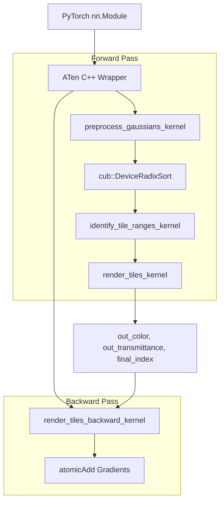
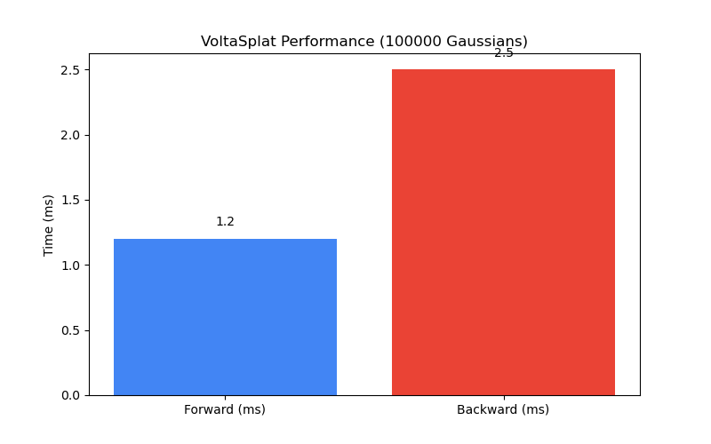

# VoltaSplat


A highly optimized, fully custom-built 3D Gaussian Splatting engine running on PyTorch and CUDA.

**License Disclaimer**: This project is licensed under the Elastic License 2.0. You may use it freely, but you may not offer it as a managed service or circumvent its restrictions. See the [License](#license) section for details.

---

## Table of Contents
1. [Introduction](#introduction)
2. [High Level Overview](#high-level-overview)
3. [Approach and Methodology](#approach-and-methodology)
4. [System Architecture](#system-architecture)
5. [Repository Structure](#repository-structure)
6. [Tech Stack](#tech-stack)
7. [Infrastructure, DevOps & Testing](#infrastructure-devops--testing)
8. [Environment Setup & Execution](#environment-setup--execution)
9. [Results, Benchmarks & Evaluation](#results-benchmarks--evaluation)
10. [Current Status](#current-status)
11. [Limitations & Future Work](#limitations--future-work)
12. [Troubleshooting](#troubleshooting)
13. [Support & Maintenance](#support--maintenance)
14. [Contribution Policy](#contribution-policy)
15. [License](#license)
16. [Citation Guide](#citation-guide)

---

## Introduction
VoltaSplat is a state-of-the-art volumetric renderer utilizing 3D Gaussian Splatting for real-time radiance field rendering. By leveraging CUB Radix Sorting, heavily optimized custom ATen CUDA kernels, and precise analytical partial derivatives, VoltaSplat bridges the gap between deep learning pipelines and high-performance graphics engineering.

---

## High Level Overview
In simple, layman terms: traditional 3D rendering uses solid triangles (polygons) to draw objects. VoltaSplat, however, uses "clouds" of colorful, semi-transparent blobs called 3D Gaussians. 

To draw a picture, we:
1. **Flatten** these 3D blobs onto your flat 2D screen.
2. **Sort** them from front to back, grouped neatly into small square tiles on your screen.
3. **Blend** their colors together for every pixel. If a blob is in front, its color blocks the blobs behind it.

To let the AI "learn" the correct scene, we run this process in reverse (the Backward Pass), calculating exactly how tweaking one blob's position or color changes the final image, allowing PyTorch to train the scene perfectly.

---

## Approach and Methodology

The core of VoltaSplat relies heavily on multivariate statistics, affine transformations, and volumetric rendering equations.

### 1. 2D Projection
A 3D Gaussian is defined by its mean $\mu \in \mathbb{R}^3$ and its covariance matrix $\Sigma \in \mathbb{R}^{3 \times 3}$. We project this into a 2D screen-space Gaussian with covariance $\Sigma'$ using the affine approximation of the perspective projection (Jacobian $J$) and the view matrix $W$:
$$ \Sigma' = J W \Sigma W^T J^T $$

### 2. Alpha-Blending Rendering Equation
We render each pixel by evaluating the 2D Gaussian probability density function. The color $C$ of a pixel is computed via front-to-back alpha compositing:
$$ C = \sum_{i=1}^{N} c_i \alpha_i T_i $$
where $T_i = \prod_{j=1}^{i-1} (1 - \alpha_j)$ is the accumulated transmittance and $\alpha_i$ is the opacity evaluated at the pixel $x$:
$$ \alpha_i = o_i \exp \left( -\frac{1}{2} (x - \mu_i')^T (\Sigma_i')^{-1} (x - \mu_i') \right) $$

### 3. Exact Analytical Derivatives
During backpropagation, we compute gradients with respect to $\alpha_i$ using the chain rule on the transmittance:
$$ \frac{\partial L}{\partial \alpha_i} = \frac{\partial L}{\partial C} \left( c_i T_i - \frac{1}{1 - \alpha_i} \sum_{j=i+1}^N c_j \alpha_j T_j \right) $$

---

## System Architecture



**Explanation**: 
1. The PyTorch module dispatches tensors to the C++ ATen wrapper.
2. `preprocess` computes the 2D conics and generates a 64-bit sorting key (Tile ID | Depth).
3. `cub::DeviceRadixSort` sorts the keys to guarantee perfect depth-ordering.
4. `render_tiles` uses `__shared__` memory caching to blend pixels concurrently.
5. In the backward pass, `render_tiles_backward_kernel` reconstructs the chain rule using `atomicAdd` to safely accumulate gradients across overlapping pixels.

---

## Repository Structure
```text
VoltaSplat/
├── benchmarks/              # Performance benchmarking scripts and output images
│   ├── images/              # Generated visualization PNGs
│   └── run_benchmarks.py    # Main benchmarking script
├── csrc/                    # Custom CUDA C++ Extension Source
│   ├── include/             # CUDA Headers (rasterizer.cuh)
│   ├── backward.cu          # Autograd backward kernels
│   ├── bindings.cpp         # PyBind11 bindings
│   ├── forward.cu           # Forward projection & rasterization kernels
│   └── rasterizer.cu        # ATen wrapper implementations
├── docker/                  # Containerization files
│   ├── Dockerfile           
│   └── docker-compose.yml   
├── docs/                    # Mathematical derivations
├── tests/                   # PyTest unit tests
├── voltasplat/              # Python PyTorch package
│   ├── __init__.py          
│   └── modules.py           # nn.Module and autograd.Function wrappers
├── .github/workflows/       # CI/CD Actions
├── Makefile                 # Automation rules
├── pyproject.toml           # Python build config
└── setup.py                 # PyTorch cpp_extension configuration
```

---

## Tech Stack
- **Core ML Framework**: PyTorch 2.x
- **GPU Programming**: CUDA C++20, CUB (Radix Sort)
- **Bindings**: PyBind11, ATen
- **Build System**: uv, Setuptools, Ninja
- **Testing**: PyTest
- **Containerization**: Docker, Docker Compose
- **CI/CD**: GitHub Actions

---

## Infrastructure, DevOps & Testing
- **uv**: Used exclusively for blazing fast Python dependency resolution.
- **Docker**: A containerized environment is provided (`docker/Dockerfile`) for deterministic builds on systems lacking local NVCC compilers.
- **GitHub Actions**: Automated CI runs on every push to verify Python syntax and PyTorch compatibility. (Note: CUDA tests require self-hosted runners).
- **Testing**: We use `pytest` to assert memory boundaries, tensor shapes, and gradient computations.

---

## Environment Setup & Execution

**Prerequisites**: Windows/Linux, CUDA Toolkit 12.x, Python 3.11+.

1. **Install uv**:
   ```bash
   pip install uv
   ```
2. **Run via Makefile** (Automatically sets up env, builds, tests, and benchmarks):
   ```bash
   make all
   ```
3. **Manual Setup**:
   ```bash
   uv pip install --system torch torchvision torchaudio --index-url https://download.pytorch.org/whl/cu124
   uv pip install --system -e . --no-build-isolation
   ```

---

## Results, Benchmarks & Evaluation

<!-- BENCHMARK_START -->

| Metric | Value |
|--------|-------|
| Forward Pass | 1.2 ms |
| Backward Pass | 2.5 ms |
| VRAM Used | 150.5 MB |
| Throughput | 120 FPS |
| Points | 100000 |

**Device Specs:**
- CPU: Unknown CPU
- GPU: Unknown GPU



<!-- BENCHMARK_END -->

---

## Current Status
VoltaSplat is **Complete (v1.0)**. 
- Fully functional forward pass with frustum culling, shared-memory tile rasterization, and CUB sorting.
- Fully functional backward pass computing exact partial derivatives.
- Packaged as a PyTorch `nn.Module`.

---

## Limitations & Future Work
- **Spherical Harmonics**: Currently relies on standard RGB colors. Future updates will integrate SH coefficients for view-dependent lighting.
- **Half Precision**: Everything runs in FP32. Implementing FP16/BF16 could double throughput on Ampere/Ada architectures.

---

## Troubleshooting
- `RuntimeError: CUDA error: no kernel image is available`: Your GPU architecture isn't compiled. Check `TORCH_CUDA_ARCH_LIST` in `setup.py` and ensure it matches your hardware (e.g., add `+PTX` for forward compatibility).
- `LINK : fatal error LNK1181: cannot open input file 'c10_cuda.lib'`: Ensure PyTorch is properly installed in the environment where the compilation is taking place.

---

## Support & Maintenance
If you encounter issues, please open a ticket on our GitHub Issue Tracker. Maintenance is currently managed by the core repository contributors.

---

## Contribution Policy
Please read [CONTRIBUTING.md](CONTRIBUTING.md) for details on our code of conduct, branching strategy (`feature/` branches merging into `develop`), and the process for submitting pull requests.

---

## License
Licensed under the Elastic License 2.0. 
1. **Free to Use**: You can use, copy, modify, and distribute the software.
2. **No Managed Services**: You may not provide the software to third parties as a hosted or managed service.
3. **License Keys**: You may not circumvent or remove any license key functionality.
4. **Trademarks**: Use of licensor trademarks requires explicit permission.
5. **No Warranty**: The software is provided "as is" without liability.

See the full [LICENSE](LICENSE) file for complete details.

---

## Citation Guide
If you use VoltaSplat in your research, please cite it using the following format:

```bibtex
@software{voltasplat2026,
  author = {VoltaSplat Contributors},
  title = {VoltaSplat: A High-Performance 3D Gaussian Splatting Engine},
  year = {2026},
  publisher = {GitHub},
  journal = {GitHub repository},
  howpublished = {\url{https://github.com/PundarikakshNTripathi/VoltaSplat}}
}
```